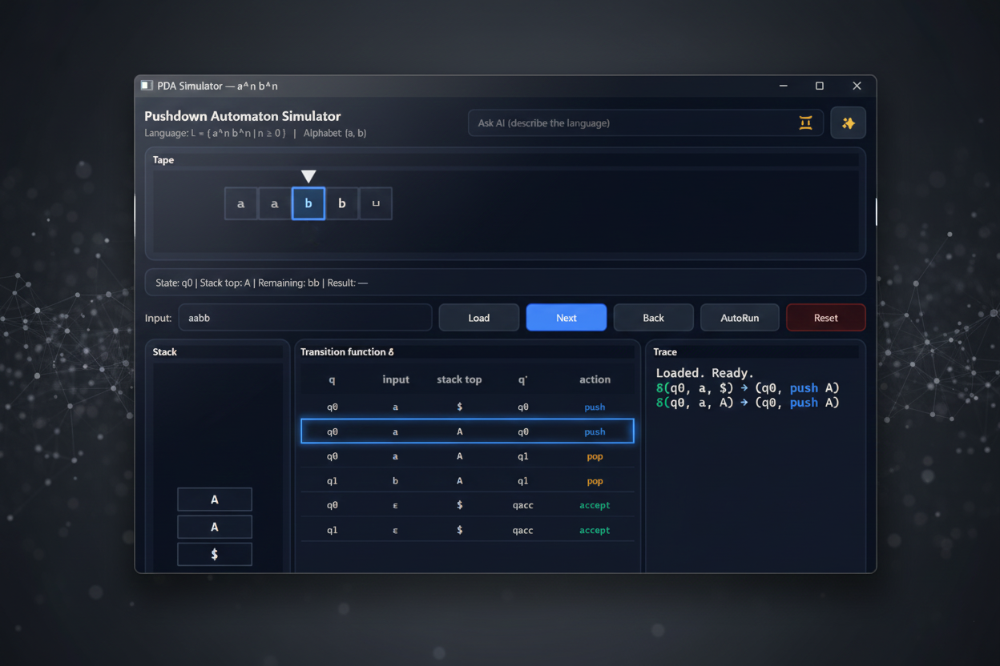
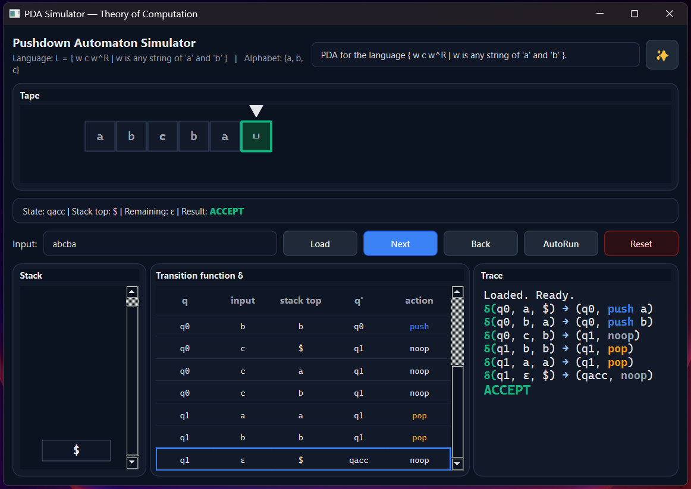

# Pushdown Automaton (DPDA) Simulator  
Theory of Computation – Course Project

A graphical Deterministic Pushdown Automaton (DPDA) simulator implemented in Python using PyQt6.
This project is developed for educational purposes to visualize PDA execution step by step.

---

## Features
- Step-by-step simulation of a Deterministic PDA
- Visual input tape with moving head
- Visual stack with push and pop animations
- Transition function δ displayed as a table
- Execution trace with ACCEPT / REJECT result
- Backtracking and automatic run mode

---

## Scope
This project focuses on:
- Formal modeling of Pushdown Automata
- Deterministic transition behavior
- Correct handling of epsilon (ε) transitions

---

## Design Note
This project was independently designed and implemented beyond the minimum course requirements.
Several features (such as full execution visualization, ε-transition handling during computation,
and AI-assisted DPDA construction) were added as design choices to deepen under

---

## AI-Assisted DPDA Construction

The following example demonstrates an automatically generated DPDA
for the language:

L = { w c w^R | w ∈ {a, b}* }

The automaton is generated using the AI-assisted mode and correctly
handles stack operations, ε-transitions, and acceptance conditions.

---
## Requirements
- Python 3.10+
- PyQt6
- requests

(Exact dependency versions are specified in `requirements.txt`.)

---

## Installation
Create a virtual environment and install dependencies:

python -m venv .venv  
pip install -r requirements.txt  

---

## Run
Execute the simulator using:

python src/pda_simulator.py

---

## Notes
- The simulator enforces determinism (one transition per state, input, and stack-top).
- Internal ε-transitions (push/pop/noop) are supported.
- Acceptance via ε-transition is allowed only when the input has been fully consumed, preventing incorrect early acceptance.

---

## Supervision
This project was developed independently under the academic supervision of:

**Dr. Saberi Najafi**  
Google Scholar: https://scholar.google.com/citations?user=rgXtd_QAAAAJ&hl=en

